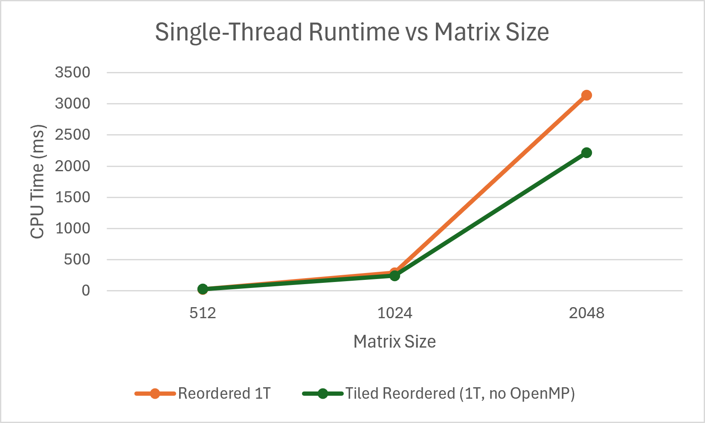
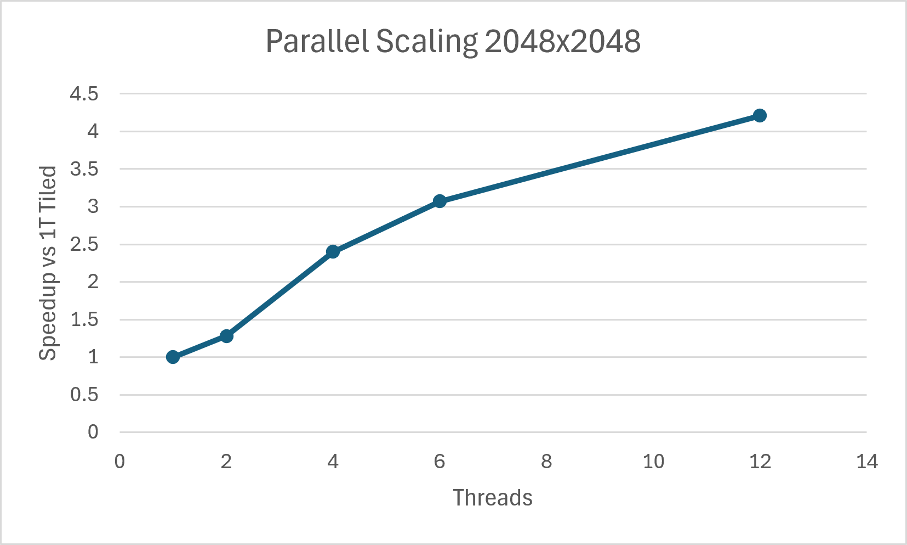

# Matrix Multiplication Optimization Benchmark
A C++ performance benchmark that explores different matrix multiplication implementations and optimization techniques.

The project compares naive multiplication, transposition, loop reordering, cache blocking, and OpenMP parallelization to study how memory access patterns, cache locality, and multithreading affect runtime.


## Features
- Naive multiplication
- Transposed multiplication
- Loop-reordered multiplication
- Cache-blocked multiplication
- OpenMP parallelization
- Google Benchmark integration
- JSON benchmark export and C++ result analysis

## Test Environment

- CPU: AMD Ryzen 5 2600
- Cores / Threads: 6 cores / 12 threads
- Compiler: GCC 16.1.0
- Build: Release
- Benchmark framework: Google Benchmark
- Matrix element type: `double`
- Tile size: 32

## Performance Results

Reported runtimes are median CPU times from 5 Google Benchmark repetitions using a Release build.

### Single-Thread Algorithm Comparison

OpenMP was disabled for these measurements to isolate the effect of cache blocking.

| Matrix Size | Reordered (1T) | Tiled Reordered (1T, no OpenMP) | Speedup from Tiling |
|---:|---:|---:|---:|
| 512  | 22.42 ms | 28.25 ms | 0.79× |
| 1024 | 290.18 ms | 243.57 ms | 1.19× |
| 2048 | 3.14 s | 2.22 s | 1.42× |

Cache blocking introduced overhead at smaller matrix sizes but became increasingly beneficial as the workload grew.



### Parallel Scaling — 2048×2048

The 1-thread baseline uses the tiled-reordered implementation with OpenMP disabled. Higher thread counts use OpenMP parallelization.

| Threads | Runtime | Speedup vs 1T Tiled |
|---:|---:|---:|
| 1  | 2.22 s | 1.00× |
| 2  | 1.73 s | 1.28× |
| 4  | 0.925 s | 2.40× |
| 6  | 0.722 s | 3.07× |
| 12 | 0.527 s | 4.21× |

At 12 threads, the parallel implementation achieved a 4.21× speedup over the single-thread tiled implementation and a 5.96× speedup over the single-thread reordered baseline.



## Optimization Approach

### Naive
Used the standard i-j-k loop order as a baseline implementation.

### Transposed
Transposed the right-hand matrix so the inner loop accesses both matrices contiguously.

### Loop Reordering
Changed the loop order to i-k-j so accesses to the right-hand matrix and output matrix occur sequentially in memory.

### Cache Blocking
Divided the matrices into smaller tiles so frequently reused data has a better chance of remaining in cache.

### OpenMP Parallelization
Parallelized independent output tiles across multiple CPU threads using OpenMP.

## Build
```
cmake -S . -B build-release -G Ninja -DCMAKE_BUILD_TYPE=Release
cmake --build build-release
.\build-release\matrix_benchmark.exe

cmake -S . -B build-debug -G Ninja -DCMAKE_BUILD_TYPE=Debug
cmake --build build-debug
```

## Run Benchmarks

### Single-Thread Comparison

Run with OpenMP disabled to isolate loop reordering and cache blocking:

```powershell
.\build-release\matrix_benchmark.exe `
  --benchmark_filter="BM_Multiply(Reordered|TiledReordered)/(512|1024|2048)$" `
  --benchmark_min_time=3s `
  --benchmark_repetitions=5 `
  --benchmark_out=results\single_thread_no_openmp.json `
  --benchmark_out_format=json
```

### OpenMP Scaling

Set the desired thread count and run the tiled-reordered benchmark:

```powershell
$env:OMP_NUM_THREADS=4

.\build-release\matrix_benchmark.exe `
  --benchmark_filter="BM_MultiplyTiledReordered/(512|1024|2048)$" `
  --benchmark_min_time=3s `
  --benchmark_repetitions=5 `
  --benchmark_out=results\openmp_4T.json `
  --benchmark_out_format=json
```

Repeat for the desired thread counts.

### Analyze Results

```powershell
.\build-release\matrix_analysis.exe `
  results\single_thread_no_openmp.json 1 `
  results\openmp_2T.json 2 `
  results\openmp_4T.json 4 `
  results\openmp_6T.json 6 `
  results\openmp_12T.json 12
```

The analyzer extracts median runtimes and writes the combined results to `results/results.csv`.

## Key Findings

- Loop reordering gave a large performance improvement over naive multiplication.
- Although transposing the right-hand matrix improved memory locality, loop reordering consistently performed better.
- Cache blocking introduced overhead at 512×512, but improved single-threaded performance by 1.19× at 1024×1024 and 1.42× at 2048×2048.
- Parallelizing the tiled-reordered implementation reduced 2048×2048 runtime from 2.22 s to 0.527 s, a 4.21× speedup over the single-thread tiled implementation.
- The 12-thread tiled-reordered implementation was 5.96× faster than the single-thread reordered baseline.
- AMD uProf measurements showed ~30% fewer L2 miss events per 1K instructions and ~89% fewer L3 misses per multiplication with cache blocking.

## Future Improvements
- Automatic tile-size selection
- SIMD/vectorization
- CUDA/GPU implementation
